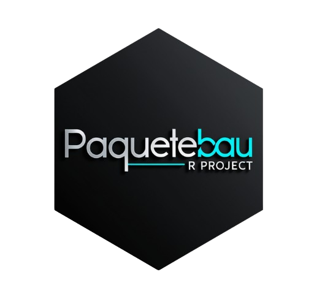

<!-- README.md is generated from README.Rmd. Please edit that file -->



# paquetebau

<!-- badges: start -->

[](https://lifecycle.r-lib.org/articles/stages.html#experimental)[](https://github.com/BautistaTorregiani/paquetebau/actions/workflows/R-CMD-check.yaml)
[](https://app.codecov.io/gh/BautistaTorregiani/paquetebau)

<!-- badges: end -->

El proposito de la creacion de este paquete es poder estudiar para el
parcial de programacion 2.

## Instalacion

You can install the development version of paquetebau from
[GitHub](https://github.com/) with:

``` r
# install.packages("pak")
pak::pak("BautistaTorregiani/paquetebau")
```

## Uso del paquete

Primero debemos importar la libreria:

``` r
library(paquetebau)
```

Luego, podemos usar dichas funciones incluidas en el paquete , como
podria ser la funcion `suma()`

``` r
suma(2,2)
#> [1] 4
```

## Autor:

[Torregiani Bautista](https://github.com/BautistaTorregiani)  
*Estudiante* de la Licenciatura en Ciencia de Datos en la Universidad
Austral

### Contribuciones al paquete:

Si deseas realizar contribuciones al paquete, ya sea para agregar
mejoras, corregir errores o proponer nuevas funciones, segui los
siguientes pasos:

1.  **Fork y clona el repositorio**: Haz un *fork* de este repositorio
    en tu cuenta de GitHub y clona el repositorio en tu máquina local.

2.  **Realiza la contribución y hace un pull request**: Realiza los
    cambios que consideres necesarios en tu copia del repositorio.
    Luego, abri un *pull request* a la rama principal del proyecto con
    una descripción clara del propósito de tu contribución.

Si tenes dudas o necesitas ayuda con el proceso de contribución, no
dudes en contactarnos a través de los siguientes correos electrónicos:

\- **Torregiani Bautista**: <btorregiani@mail.austral.edu.ar>

#### Codigo de contribución:

<https://github.com/BautistaTorregiani/paquetebau/blob/master/CODE_OF_CONDUCT.md>
